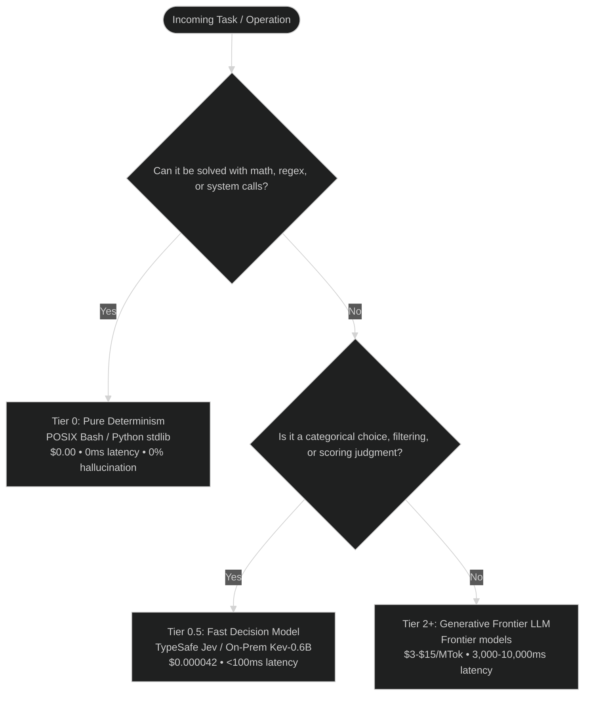
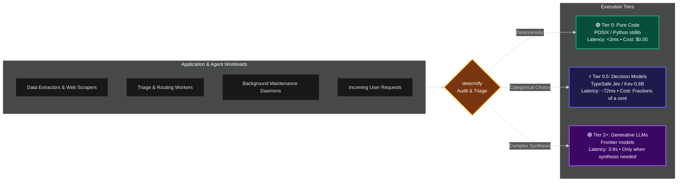

# ⚡ determify

> **"Never use an LLM if a 3-line Bash script solves it for zero tokens, zero latency, and zero hallucinations."**

`determify` is a standalone static scanner for agentic codebases. It finds the places where your code hands an LLM a job that plain code can finish faster, cheaper, and without hallucinating.

> 💡 **Zero dependencies, fully standalone.**  
> You do not need an API key, an LLM, or TypeSafe Jev to run `determify`.  
> It scans offline by default and installs with no external dependencies. Point it at Jev or a local Kev and it adds semantic triage on top of the static findings.

Inspired by **[jevify](https://github.com/altryne/jevify)**, `determify` audits code, agent tool definitions, and automation scripts for calls that ask a generative model (Claude, GPT, Gemini) to do work standard code finishes in 2ms for $0.00.

---

## 🎯 The 3-tier arbitration model

Every task in an agentic pipeline belongs to one of three tiers:



- **Tier 0. Pure deterministic code.** File checks, YAML and JSON extraction, relative timestamps, regex cleaning, line counts. Standard code handles all of it.
- **Tier 0.5. Non-autoregressive decision models** (TypeSafe Jev, Kev-0.6B). Classification, routing, intent gating, rubric scoring, relevance filtering. Answers in under 100ms and emits zero output tokens.
- **Tier 2+. Generative frontier LLMs.** Open-ended generation, creative writing, synthesis, multi-hop reasoning. Reserved strictly for tasks that require deep cognitive synthesis.

---

## 🔍 What determify detects

| Rule ID | Category | Common AI anti-pattern | Cheaper fix |
| :--- | :--- | :--- | :--- |
| **DET-01** | Date / time math | Prompting an LLM for today's date or relative time formatting | `datetime.now()`, `timedelta`, `date -d` |
| **DET-02** | File / path checks | Asking an LLM if a file exists or listing files | `os.path.exists()`, `pathlib.Path`, `glob` |
| **DET-03** | Structured parsing | Prompting an LLM to extract YAML frontmatter or headers | `yaml.safe_load()`, `json.loads()`, regex |
| **DET-04** | Document sizing | Using an LLM to count PDF pages or classify size | `pdfinfo`, `pypdf`, `os.path.getsize` |
| **DET-05** | Text cleaning | Prompting an LLM to strip HTML tags or whitespace | `re.sub()`, `BeautifulSoup`, `sed` / `tr` |
| **DET-06** | Keyword checks | Using an LLM to test for exact string or token membership | Python `in` operator, `grep -E` |
| **DET-07** | Ungated AI invocation | Invoking raw LLM SDKs or CLI agents without a decision gate | Route through a Tier 0 or Tier 0.5 gate first |
| **DET-DEEP** | Semantic LLM misuse | Subtle data formatting, basic triage, or redundant chaining | Chunked semantic analysis with Jev or Kev |

---

## 🚀 Installation

```bash
git clone https://github.com/rodericklm1/determify.git
cd determify
pip install -e .
```

---

## 💻 Usage

### 1. Standalone static scan (no API key, no setup)

Scan any file or directory. `determify` runs offline and needs no configuration.

```bash
# Scan current directory
determify

# Scan specific path
determify ./src
```

---

### ⚡ Optional semantic triage with Jev or Kev

`determify` works on its own. Add a decision model and it will also triage the findings it is not sure about.

Two options are available:

1. **Cloud.** [TypeSafe Jev](https://docs.typesafe.ai) via the OpenRouter Decisions API.
2. **Local or self-hosted.** **[Kev](https://github.com/jaredpalmer/kev).** Jared Palmer's open-weights 0.6B non-autoregressive decision model. It is fully API-compatible with TypeSafe System One, self-hosts on your own GPU or CPU for zero API fees, and returns a decision in under 90ms.

#### 2. Intelligent triage with TypeSafe Jev (`--jev`)

Pass suspicious call sites directly to TypeSafe Jev via the OpenRouter Decisions API. In under 100ms, Jev evaluates the surrounding code and classifies whether it is truly deterministic, a decision candidate, or legitimately generative.

```bash
export OPENROUTER_API_KEY="your-key"
determify ./src --jev
```

#### 3. On-premises air-gapped triage with Kev-0.6B (`--kev`)

For complete privacy, zero API costs, or offline air-gapped execution, deploy **[jaredpalmer/kev](https://github.com/jaredpalmer/kev)** locally. `determify` talks directly to Kev's `/v1/systemone` endpoint.

```bash
# Point to your local or LAN Kev server (default: http://localhost:8009/v1/systemone)
export KEV_ENDPOINT="http://localhost:8009/v1/systemone"
determify ./src --kev
```

> **How to run Kev.** The official repository at **[github.com/jaredpalmer/kev](https://github.com/jaredpalmer/kev)** shows how to run the lightweight server with PyTorch or vLLM. It needs about 2.5GB of VRAM and runs in `bf16` on a consumer GPU.

#### 4. Deep semantic codebase sweep (`--deep`)

Simple regexes miss subtle prompt misuse. `--deep` sends whole functions and scripts to the decision engine for semantic inspection. An explicit `--jev` or `--kev` flag is mandatory, so source code never leaves for the cloud by accident.

```bash
# Cloud Jev deep scan:
determify ./src --jev --deep

# Or completely local and free via Kev:
determify ./src --kev --deep
```

#### 5. CI/CD and automation (JSON output)

Output structured JSON findings for automated linters, CI pipelines, or pre-commit hooks. Use `--fail-on-findings` to exit with code 1 when actionable anti-patterns appear.

```bash
determify ./src --json --fail-on-findings
```

---

## 📊 Benchmark and architecture

Frontier-only pipelines burn 2,000 to 30,000 tokens on trivial checks. `determify` routes each task to the cheapest tier that can handle it.



---

## 🤝 Ecosystem compatibility

`determify`'s DET-07 rule matches these literal call and CLI signatures:

- **SDK call sites.** `openai.completions.create`, `openai.chat.completions.create`, `anthropic.messages.create`, `client.chat.completions`, `client.messages.create`, `client.responses.create`, `llm.complete`, `model.generate_content`.
- **Chat model classes.** `ChatOpenAI(...)`, `ChatAnthropic(...)` (LangChain).
- **Agent CLIs and subprocesses.** `opencode run`, `hermes run`, `claude -p`, `sgpt -s/-o/-e/-c`.

---

## 📜 License

MIT License. Copyright (c) 2026 rodericklm1.
