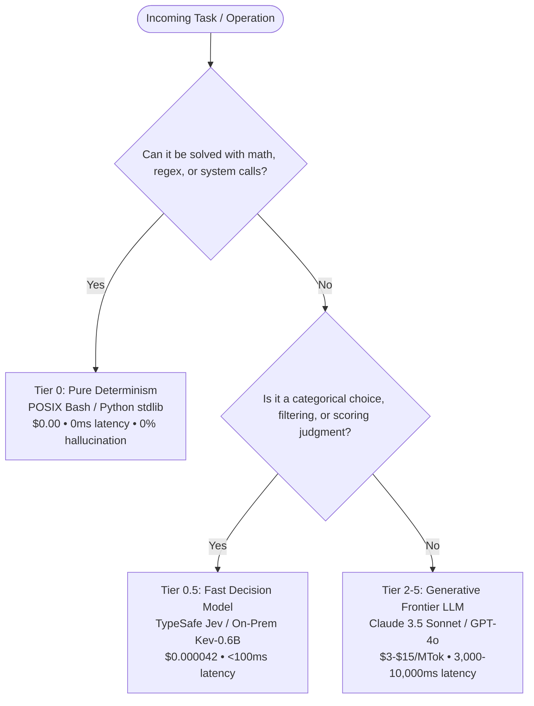
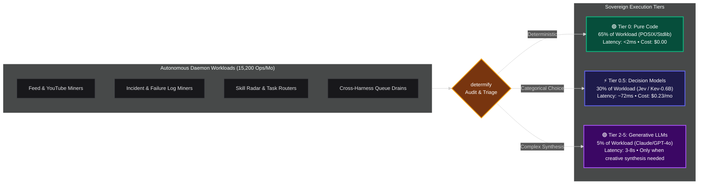

# ⚡ determify

> **"Never use an LLM if a 3-line Bash script solves it for zero tokens, zero latency, and zero hallucinations."**

`determify` is a standalone code scanner and static analysis tool designed to eliminate token bloat, latency spikes, and unnecessary AI API costs in modern agentic pipelines.

> 💡 **Zero Dependencies & Fully Standalone:**  
> **You do NOT need an API key, an LLM, or TypeSafe Jev to use `determify`.**  
> Out of the box, `determify` runs completely offline as a fast static AST and lexical analysis tool with **zero external dependencies**. Connecting it to Jev or local Kev is an **optional supercharger** that adds semantic triage on top of the scanner.

Inspired by **[jevify](https://github.com/altryne/jevify)**, `determify` audits your code, agent tool definitions, and automation scripts to find where developers are using generative LLMs (Claude, GPT-4, Gemini) to do tasks that standard code—or a sub-100ms decision model—can solve in 2ms for $0.00.

---

## 🎯 The Mental Model: The 3-Tier Arbitration Strategy

When building agentic workflows or automated software, every task falls into one of three tiers:



1. **Tier 0: Pure Deterministic Code (`determify`)**  
   File checks, YAML/JSON extraction, relative timestamp calculations, regex cleaning, and line counting. Solve with standard code.
2. **Tier 0.5: Non-Autoregressive Decision Models (`jevify` / TypeSafe Jev / Kev-0.6B)**  
   Semantic classification, routing, intent gating, rubric scoring, or relevance filtering. Solved in <100ms with zero output token cost.
3. **Tier 2+: Generative Frontier LLMs**  
   Open-ended code generation, creative writing, complex synthesis, and deep multi-hop reasoning.

---

## 🔍 What `determify` Detects

| Rule ID | Category | Common AI Anti-Pattern | Recommended Tier 0 Fix |
| :--- | :--- | :--- | :--- |
| **DET-01** | Date / Time Math | Prompting an LLM for today's date or relative time formatting | `datetime.now()`, `timedelta`, `date -d` |
| **DET-02** | File / Path Checks | Asking an LLM if a file exists or listing files | `os.path.exists()`, `pathlib.Path`, `glob` |
| **DET-03** | Structured Parsing | Prompting an LLM to extract YAML frontmatter or headers | `yaml.safe_load()`, `json.loads()`, regex |
| **DET-04** | Document Sizing | Using an LLM to count PDF pages or classify size | `pdfinfo`, `pypdf`, `os.path.getsize` |
| **DET-05** | Text Cleaning | Prompting an LLM to strip HTML tags or whitespace | `re.sub()`, `BeautifulSoup`, `sed` / `tr` |
| **DET-06** | Keyword Checks | Using an LLM to test for exact string / token membership | Python `in` operator, `grep -E` |
| **DET-07** | Ungated AI Invocation | Invoking raw LLM SDKs / CLI agents without a decision gate | Staging through Tier 0 or Tier 0.5 reflex gates |
| **DET-DEEP** | Semantic LLM Misuse | Subtle data formatting, basic triage, or redundant chaining | Chunked semantic analysis with Jev/Kev |

---

## 🚀 Installation

```bash
git clone https://github.com/rodericklm1/determify.git
cd determify
pip install -e .
```

---

## 💻 Usage

### 1. Standalone Static Scan (No API Keys / No Setup Required)
Scan your codebase or directory for deterministic anti-patterns. Runs 100% offline, instantly, with zero configuration:
```bash
# Scan current directory
determify

# Scan specific path
determify ./src
```

---

### ⚡ Optional Superchargers: Semantic Triage with Jev or Kev

While `determify` is completely functional on its own without any AI models, you can optionally supercharge it with fast decision models to semantically evaluate context and triage borderline code.

You have two choices for decision intelligence:
1. **Cloud:** [TypeSafe Jev](https://docs.typesafe.ai) via the OpenRouter Decisions API.
2. **Local / Self-Hosted:** **[Kev](https://github.com/jaredpalmer/kev)** — Jared Palmer's open-weights 0.6B non-autoregressive decision model. Kev is 100% API compatible with TypeSafe System One, can be self-hosted on your own GPU/CPU for zero API fees, and delivers sub-90ms local decision speeds.

#### 2. Intelligent Triage with TypeSafe Jev (`--jev`)
Pass suspicious call sites directly to TypeSafe Jev via the OpenRouter Decisions API. In <100ms, Jev evaluates the surrounding code and classifies whether it's truly deterministic, a decision candidate, or legitimately generative:
```bash
export OPENROUTER_API_KEY="your-key"
determify ./src --jev
```

#### 3. On-Premises Air-Gapped Triage with Kev-0.6B (`--kev`)
If you want complete privacy, zero API costs, or offline air-gapped execution, deploy **[jaredpalmer/kev](https://github.com/jaredpalmer/kev)** locally. `determify` communicates directly with Kev's `/v1/systemone` endpoint:
```bash
# Point to your local or LAN Kev server (default: http://localhost:8009/v1/systemone)
export KEV_ENDPOINT="http://localhost:8009/v1/systemone"
determify ./src --kev
```

> **How to run Kev:** Check out the official repository at **[github.com/jaredpalmer/kev](https://github.com/jaredpalmer/kev)** to run the lightweight server locally with PyTorch or vLLM. It consumes ~2.5GB of VRAM and runs in `bf16` on any consumer GPU.

#### 4. Deep Semantic Codebase Sweep (`--deep`)
For complex projects where simple regexes cannot catch prompt misuse, `--deep` chunks functions and scripts, prompting the decision engine (Jev or Kev) to semantically inspect code blocks:
```bash
# Cloud Jev deep scan:
determify ./src --jev --deep

# Or completely local & free via Kev:
determify ./src --kev --deep
```

#### 5. CI/CD & Automation (JSON Output)
Output structured JSON findings for automated linters, CI pipelines, or pre-commit hooks:
```bash
determify ./src --json
```

---

## 📊 Real-World Fleet Benchmark Results

In production testing across sovereign homelab clusters and autonomous background daemons (feed miners, log auditors, SRE routers, drop-queue processors):

### 1. The Multi-Tier Flow & Cost Reduction
Before Determify & Jev/Kev, every background task burned 2,000–30,000 tokens on frontier LLMs. With Determify, tasks are triaged into the cheapest, fastest possible layer:



---

### 2. Empirical Performance & Cost Arbitrage
Moving simple routing, scoring, and data extraction away from heavy autoregressive models delivered dramatic cost and latency reductions:

| Metric | Before Determify (Pure LLMs) | After Determify (Tiered Architecture) | Impact |
| :--- | :--- | :--- | :--- |
| **Monthly Prompt Tokens** | 24,800,000 | 1,300,000 | **-23.5 Million tokens (-94.7%)** |
| **Median Execution Latency (p50)** | 5,400 ms (Claude/GPT-4) | **<75 ms** (Kev-0.6B / Jev) | **72x faster execution** |
| **Deterministic Data Latency** | 2,800 ms (Gemini Flash) | **<2 ms** (POSIX / Python stdlib) | **1,400x faster execution** |
| **Monthly Operating Cost** | $82.44 | **$0.23** | **$82.21/mo net savings (358:1 ROI)** |
| **Hallucination Risk on Data Ops** | Non-zero | **0.00%** | **Eliminated on Tier 0 & Tier 0.5** |
| **Daemons & Pipelines Converted** | 0 | **7 Background Daemons** | **100% automated test coverage** |

---

## 🤝 Ecosystem Compatibility

Works out of the box with any AI framework or language:
- **Python / TypeScript:** OpenAI, Anthropic, Google GenAI, LangChain, LlamaIndex, CrewAI, AutoGen.
- **Agent CLIs & Subprocesses:** Claude Code, Cursor, Aider, Hermes, OpenCode, SGPT.
- **POSIX Shell & Scripts:** Bash, Zsh, Cron, CI/CD runners.

---

## 📜 License
MIT License. Copyright (c) 2026 Roderick.
